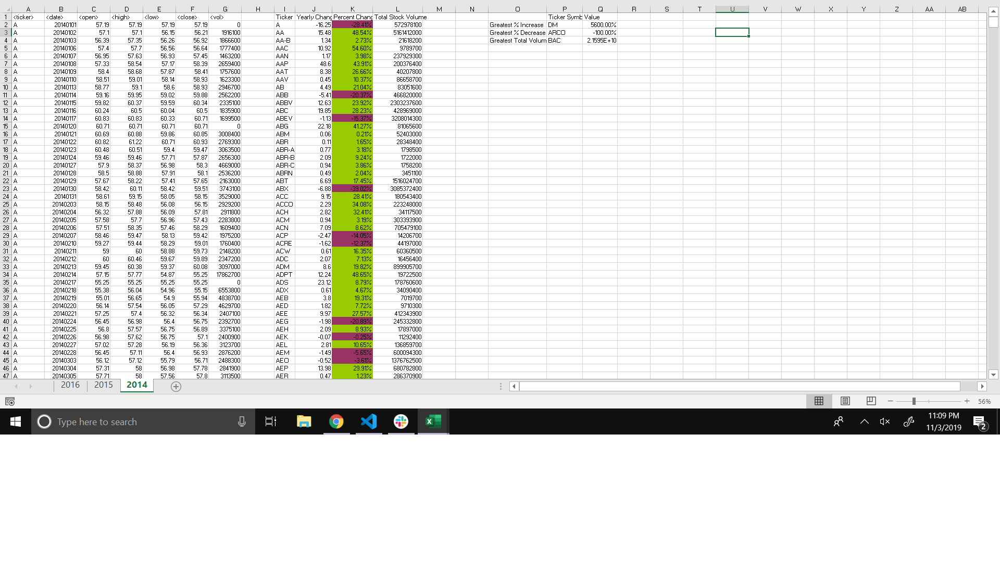
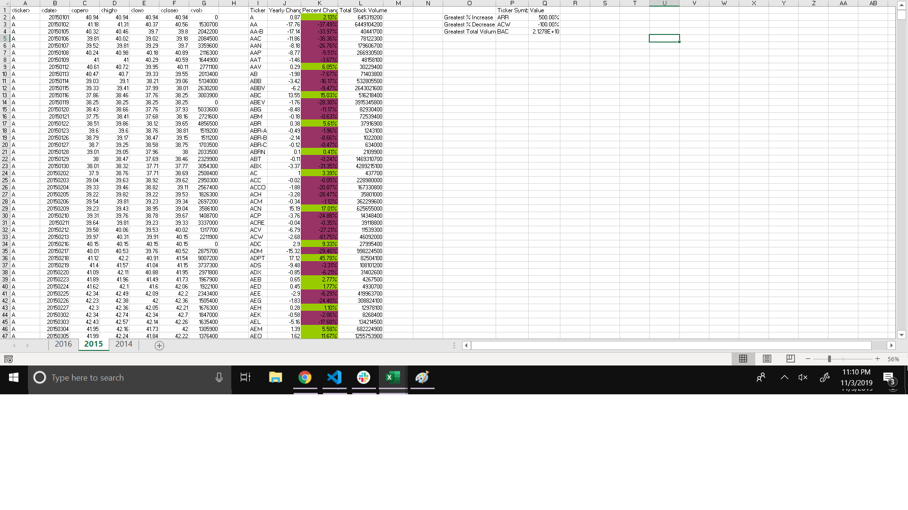
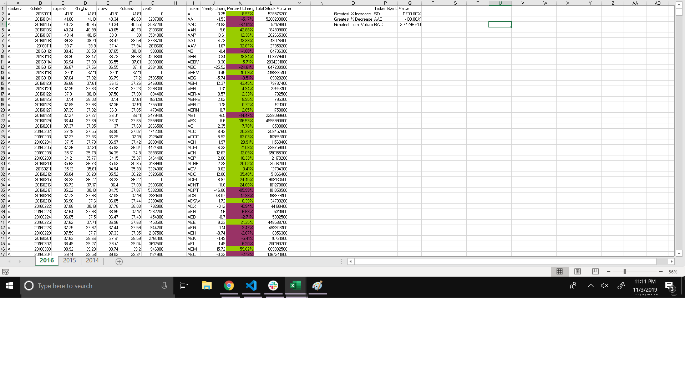

# VBA Stocks Exercise

Thiss script was developed as an exercise in VBA Scripting for Rutgers Data Science & Visualization Bootcamp. 

The script loops through all the stocks for one year for each run and...
1. Takes the ticker symbol.
2. Yearly change from opening price at the beginning of the year to the closing price at the end of the year.
3. The percent change from opening price at the beginning of the year to the closing price at the end of the year.
4. The total stock volume of the stock.
5. Sets conditional formatting  that will highlight positive change in green and negative change in red.
6. Adds another table that states the greatest increase, decrease, and highest total volume tickers per worksheet.

# Images of the Final Excel Sheets:

### 2014

### 2014

### 2014
